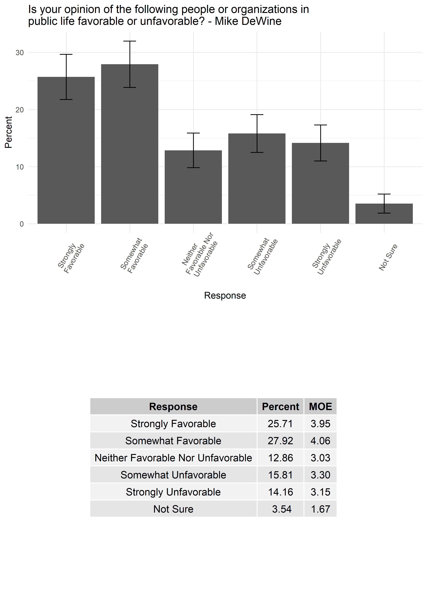

## Crosstab party results 

The following are the cross tab results for by party. Those categorized as leaning asked to express which party that they generally identify with. All but one respondent said they usually vote and identify with one of the two major parties. 


```{r topline, out.width = "100%", echo=FALSE, fig.align='center'}
#q_order <- readRDS("question_order_vec.rds")


#print(file_names_pt[5])

#knitr::include_graphics(file_names_pt[5])
#{#id .class width=30 height=20px}
details = file.info(list.files("party_png", full.names = T)) #gets the file creation dates/times
details <- details[with(details, order(as.POSIXct(mtime))), ] #orders everything by date/time
files = rownames(details) # get the rownames 

#file_names_pt <- paste0("reports_png",sep="/" ,files) ## looks good

#knitr::include_graphics(files[4]) # this now works, given that we have 
# the full file name. Should be able to proceed with test loop 


knitr::include_graphics( as.character(files)) # create the plots as ordered by the date/time

#


#for(i in files) {
#  knitr::include_graphics(paste0("", "\n"))
#   cat("\n\n\\pagebreak\n")
#}


```

## Crosstab gender results

The following are the results by gender, as expressed by male, female, and non-binary/other. 

```{r gendercross, out.width = "100%", echo=FALSE, fig.align='center'}
#q_order <- readRDS("question_order_vec.rds")


#print(file_names_pt[5])

#knitr::include_graphics(file_names_pt[5])
#{#id .class width=30 height=20px}
details_g = file.info(list.files("gender_png", full.names = T))
details_G <- details_g[with(details_g, order(as.POSIXct(mtime))), ]
files_g = rownames(details_g)

#file_names_pt <- paste0("reports_png",sep="/" ,files) ## looks good

#knitr::include_graphics(files[4]) # this now works, given that we have 
# the full file name. Should be able to proceed with test loop 


knitr::include_graphics( as.character(files_g))

#


#for(i in files) {
#  knitr::include_graphics(paste0("", "\n"))
#   cat("\n\n\\pagebreak\n")
#}


```
