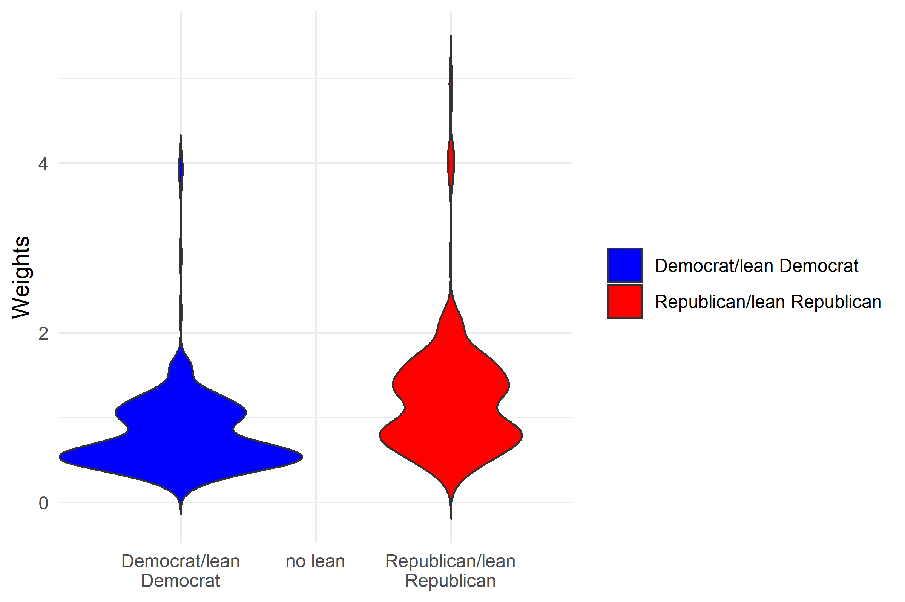

```{r setup, include=FALSE}
knitr::opts_chunk$set(
  echo = FALSE,
  message = FALSE,
  warning = FALSE,
  dev = "svg",
  fig.width = 20,
  fig.height = 20,
)
```

# Northern Poll

The following are the distribution of survey weights by party.  

```{r weights, out.width = "100%", echo=FALSE, fig.align='center',fig.cap="Distribution of survey weights by party" }
#q_order <- readRDS("question_order_vec.rds")




```


## Results 

In what follows, we see the topline survey results for the 

```{r topline, echo=FALSE, fig.align='center', fig.width=20,fig.height=20}
#q_order <- readRDS("question_order_vec.rds")


#print(file_names_pt[5])

#knitr::include_graphics(file_names_pt[5])
#{#id .class width=30 height=20px}
details = file.info(list.files("reports_png", full.names = T))
details <- details[with(details, order(as.POSIXct(mtime))), ]
files = rownames(details)
files = files[1:93]
#file_names_pt <- paste0("reports_png",sep="/" ,files) ## looks good

#knitr::include_graphics(files[4]) # this now works, given that we have 
# the full file name. Should be able to proceed with test loop 


knitr::include_graphics(as.character(files))

#knitr::include_graphics("reports_png/favorability_dewine_table.png")


#for(i in files) {
#  knitr::include_graphics(paste0("", "\n"))
#   cat("\n\n\\pagebreak\n")
#}


```
